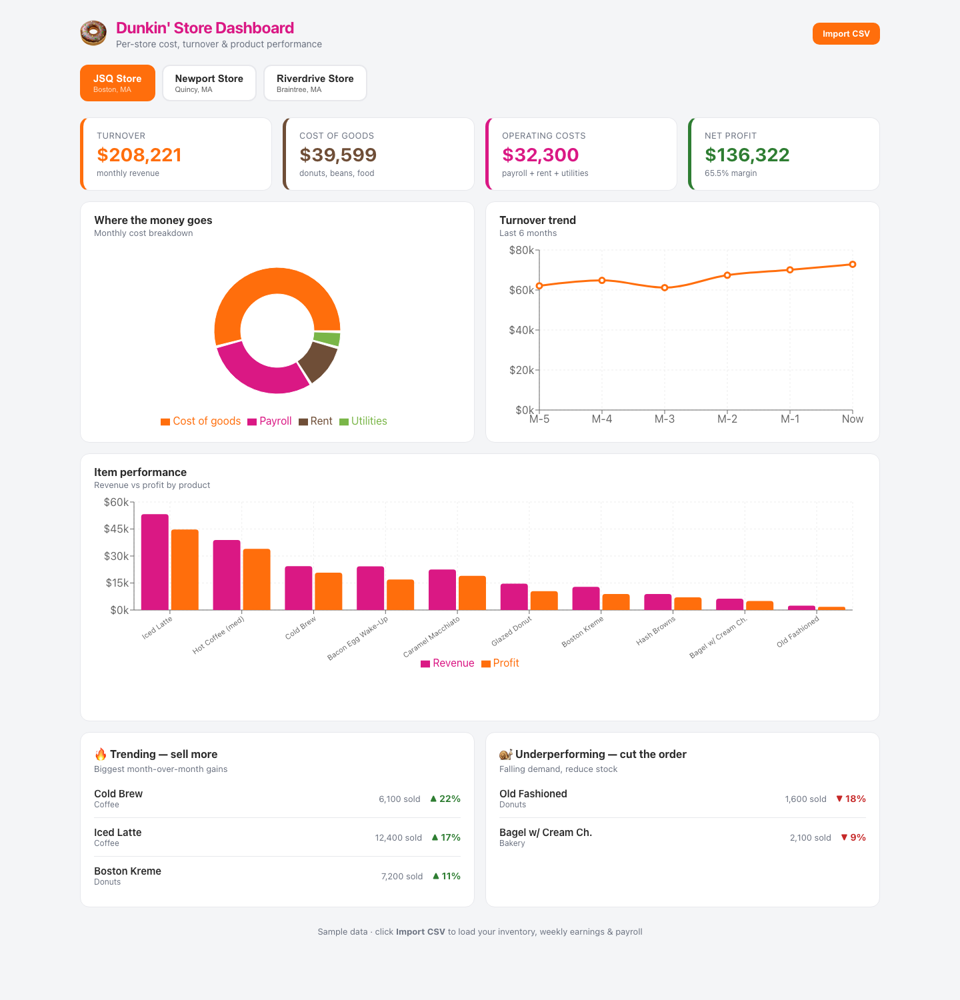

# Dunkin' Store Dashboard

**Live demo:** https://AJJadhav29.github.io/dunkin-dashboard/

A React + Vite dashboard with a **separate view for each of three Dunkin' stores**.
For every store it shows:

- **KPIs** — Turnover, Cost of Goods, Operating Costs, Net Profit (with margin %)
- **Cost breakdown** — donut chart of cost-of-goods vs payroll vs rent vs utilities
- **Turnover trend** — last 6 months
- **Item performance** — revenue vs profit for every product
- **🔥 Trending** — products selling more month-over-month (order more)
- **🐌 Underperforming** — products with falling demand (cut the order)



## Run it

```bash
npm install
npm run dev      # http://localhost:5173
```

Build for production: `npm run build` (output in `dist/`).

## Using your real numbers

All figures live in **`src/data.js`**. Each store has:

- per-item rows: `unitsSold`, `costPrice`, `sellPrice`, `trendPct` (% change vs last month)
- fixed monthly costs: `payroll`, `rent`, `utilities`
- a 6-month `history` array for the turnover trend line

Everything else (turnover, cost of goods, profit, margins, top sellers, trending
and underperforming lists) is **computed automatically** from those inputs — so the
dashboard stays consistent when you edit the data. The `trendPct` value drives which
items show up as trending vs underperforming.
